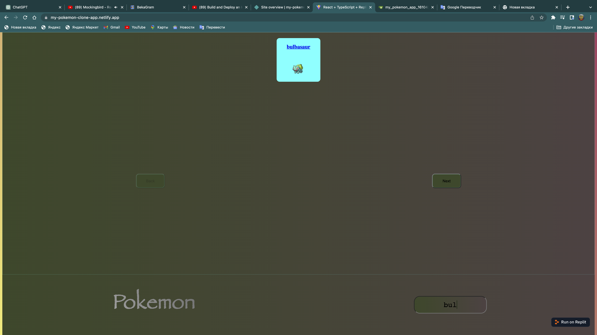

## Welcome to My Pokemon App
Hello my dear friend. I'm so glad you're checking out my Pokemon app project.<br><br>

## Task

The task of this project was to create a pokemon app clone via API and I think I succeeded.<br><br>
## Description

I learned how to work with API in this project and it helped me to learn new things<br><br>

## project photo
Home<br><br>
<br><br>
Search<br><br>
<br><br>

## Installation
```
npx create-react-app pokemon.app
```
```
npm I
```
```
npm i build
```
```
npm start
```
You can use the project I wrote in the same way you use the pokemon app in this project !!!just type the name you want in the search box and it will appear on your screen!!!<br><br>
## Usage

I hope you like the pokemon app code I linked this netlify link: <a href="https://my-pokemon-clone-app.netlify.app">Pokemon</a>  <br><br>


### The Core Team 


```
Tolaganov Nodirjon
```
qwasar nik 
```
tulagano_n
```
<span><i>Made at <a href='https://qwasar.io'>Qwasar SV -- Software Engineering School</a></i></span>
<span></span>